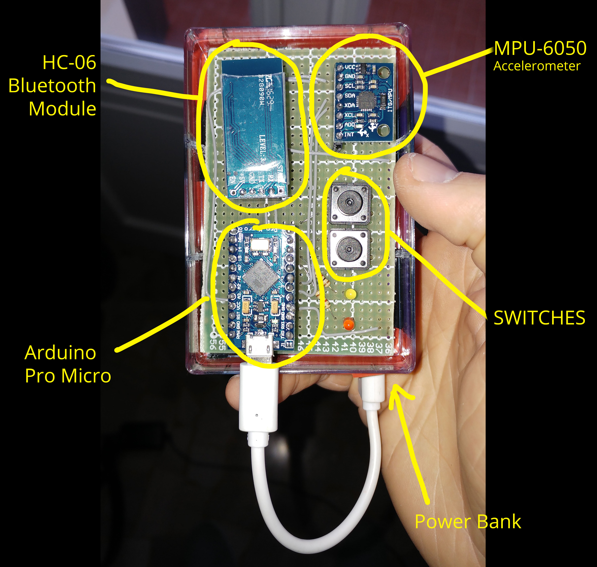

# gesture-keyboard
Gesture keyboard is a library used to convert accelerometer data to a sequence of characters and sentences.

If you want to implement or customize this yourself, [check out the tutorial below.](#How-to-use-the-Library)

## Demostration Video
[Click here to watch the demonstration video](https://www.youtube.com/watch?v=OjTNS2ZKqRc)

## Module

In order to get the accelerometer data, I build a module using an Arduino, a MPU-6050 as accelerometer and a HC-06 to enable bluetooth comunication. The entire module gets powered by using a power bank.



When someone press the first button, the module starts to send accelerometer data to the pc.
When the button is relased, the transmission stops.

## Library

The library it's written in Python and uses Scikit-learn's SVM (Support Vector Machine) algorithm to classify the signals into letters.

### On Windows
If you are using windows, the easiest way to download the needed libraries is to [download the Python(X,Y) distribution here.](https://python-xy.github.io/). It comes with all the necessary software built in.

## How to Use the Library

These are the basic steps needed to implement this library and to customize it.

### Arduino

Any Arduino will work for this project, you will also need an MPU-6050 accelerometer and a button.

You can get the Arduino Sketch in the Arduino folder inside the project. You will probaby need to make a few changes to make it work.

**NOTE: If you don't want to use a Bluetooth module with this project, check out the BASIC version of the Sketch in the Arduino folder.**

After flashing the sketch to the Arduino, make sure that everything works correctly:
* Open the Serial Monitor in the Arduino IDE
* Set the baudrate to 38400
* Press the button on the Arduino for a short time, you should see an output like this:
```
STARTING BATCH
START -296 280 17140 -501 225 -1154 END
START 724 152 16228 -396 298 -176 END
START 372 16 16740 -346 219 -180 END
...
START 1096 1200 16644 -206 288 -2445 END
START 1632 1060 16104 -290 95 -3108 END
CLOSING BATCH
```

### Gesture Keyboard Library

Now that everything is working, let's dive into the library.
While a Dataset is already included, you should create a new one for a few reasons:
* Every device is different, even a small change in the accelerometer position makes the device less precise. **Everytime you change your device you should create a new dataset, to improve precision.**
* If you want to change or add gestures, you have add new data to the dataset.

#### Working with the Dataset

Start by deleting the content of the `data` folder, we will replace it with a newly created dataset.

This library was originally conceived to make a keyboard, so each gesture is associated with a character ( case sensitive ). This means that you can teach the algorithm a maximum of about 60 different gestures.

Let's start a new recording batch, where you will record new samples for a specific gesture.
Open the terminal and write:

```
python start.py target=a:0 port=COM6
```

Explanation:
* The "target" argument tells the module that we want to record new samples for a specific gesture.
* The "a" character is the one that characterize a gesture, it must be unique for every gesture and it must have a length of 1.
* The "0" character is the *batch number*, it must be different every time you register a new batch to avoid sample overriding. For example, the first time you record a batch set it to 0, the next time 1 and so on.
* The "port" represents the serial port your Arduino is connected to.

When start.py is running, you will record different samples by pushing and relasing the integrated button on the Arduino. When the button is pressed, the library records the data from the accelerometer. For each gesture, a good number of samples is 40.

Every sample get saved as a different file in the data folder.

### Train the Model

When your dataset is ready, you can use it to train the machine learning algorithm. This is pretty straightforward, open the terminal and write:

```
python learn.py
```

#### In case of problems:
If you have problems with the library "model_selection", you have to upgrade your Sklearn dependency. 
Try to use the command: `pip install --upgrade sklearn`.

### Use the model

To check out if the model is working, open the terminal and write:

```
python start.py port=<YOUR_SERIAL_PORT> predict
```

Now you can make gestures and see the algorithm predicting the correct one, most of the times :)
